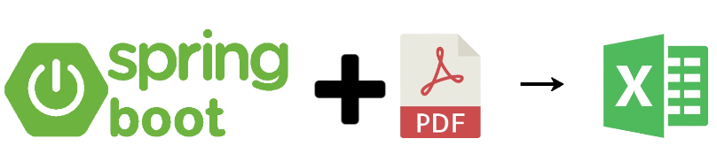
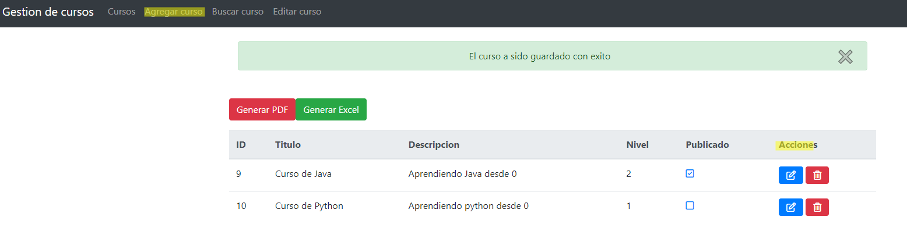
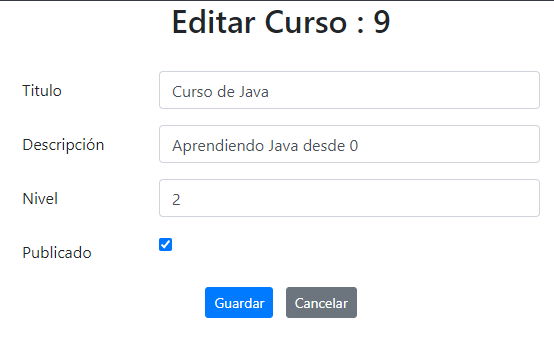
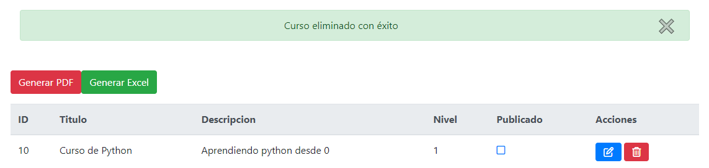
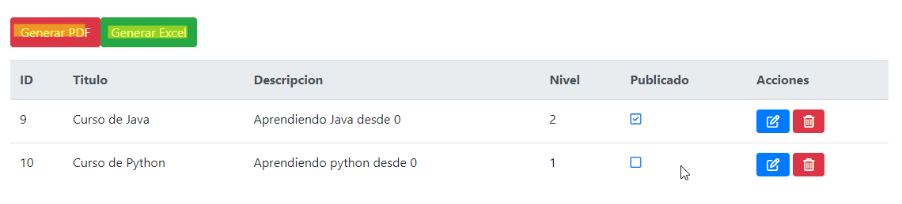
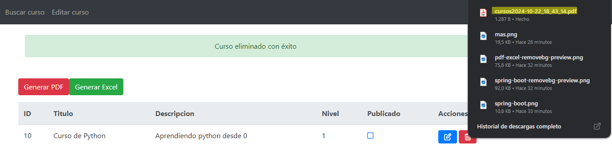

# Gestión de Cursos y Generación de Reportes
Este proyecto permite la gestión integral de cursos, ofreciendo una plataforma eficiente para crear, editar y visualizar información detallada sobre cada curso. Además, incluye la funcionalidad de generar reportes personalizados de los cursos en formatos PDF y Excel, facilitando la exportación y el análisis de la información. Esta herramienta está diseñada para optimizar la administración académica, brindando una solución intuitiva y completa para instituciones educativas o entornos que requieran una gestión estructurada de cursos.

## Para este proyecto usamos las herramientas:
### Java - Spring Boot
### Thymeleaf
### HTML - CSS
### MySQL

## Cursos con operaciones CRUD
El proyecto implementa un sistema completo de gestión de cursos utilizando operaciones CRUD (Crear, Leer, Actualizar y Eliminar). A través de una interfaz intuitiva, los usuarios pueden agregar nuevos cursos con detalles relevantes, visualizar una lista completa de los cursos existentes, actualizar la información de los cursos según sea necesario y eliminar aquellos que ya no se requieran. Este sistema CRUD garantiza un control total sobre la gestión de los cursos, proporcionando una solución flexible y adaptable para cualquier institución educativa o entorno de aprendizaje.
Como podemos apreciar tenemos la opción de AGREGAR un curso, en las acciones podemos MODIFICAR o ELIMINAR un curso que querramos y en el index(pantalla principal) podemos ver todos los cursos de nuestra base de datos

## Visualización de cursos

## Editar un curso

## Eliminar un curso

## Generación de PDFs y Excel de los cursos
Además de gestionar los cursos a través del sistema CRUD, este proyecto permite la generación de reportes detallados de los cursos en formatos PDF y Excel. Los usuarios pueden exportar la lista completa de cursos o información específica de cada uno, facilitando el análisis y la presentación de datos. Esta funcionalidad es ideal para la documentación formal o para compartir la información de manera eficiente, brindando flexibilidad al adaptarse a diferentes necesidades de presentación y almacenamiento de datos.

## Redes

- [Linkedin - Francisco Jesús](https://www.linkedin.com/in/francisco-jes%C3%BAs-sono-callla-820a6526a/)
- [Gmail - jesusc6482@gmail.com]()
- [Whatsapp](https://wa.me/929226405)
